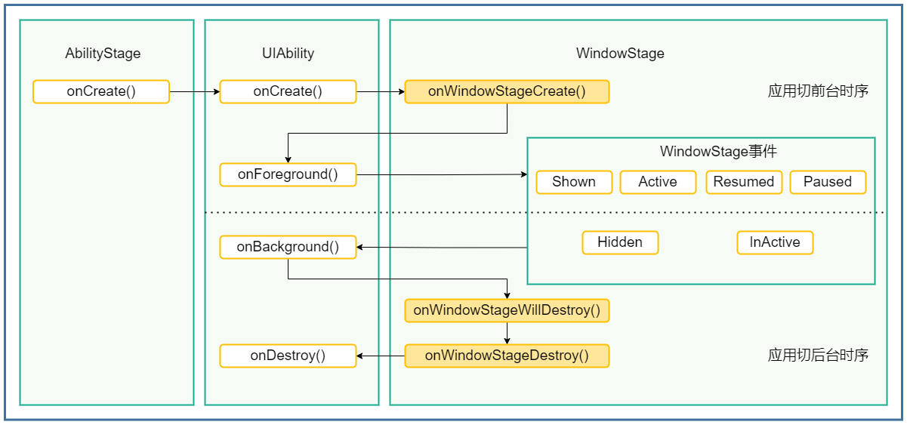
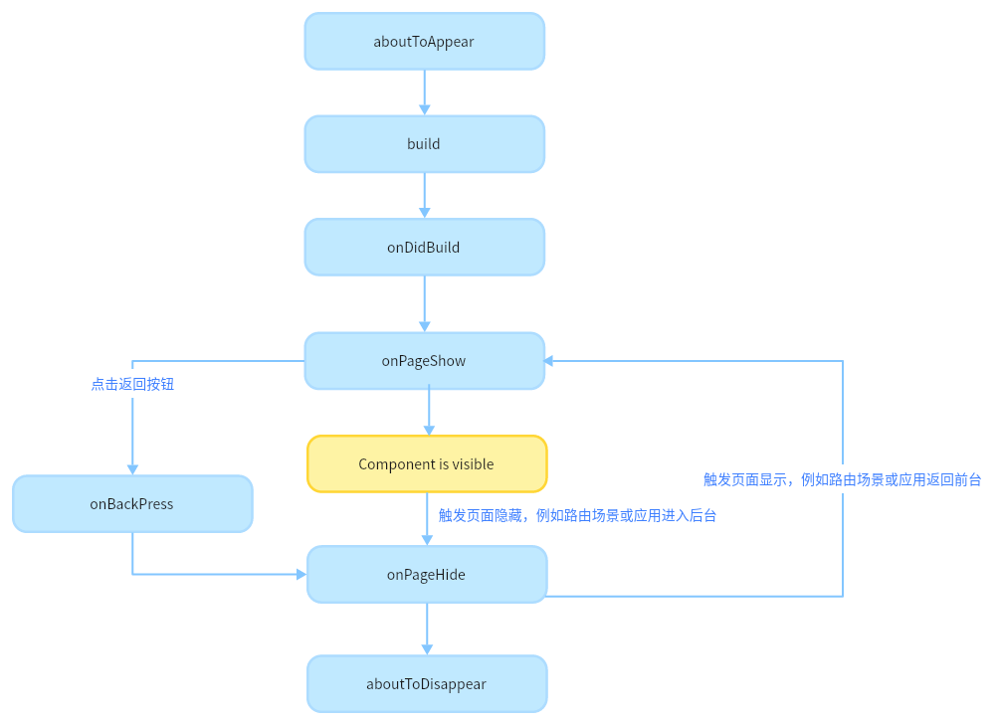

# HarmoneyOS Part
[[toc]]
## HarmoneyOS 的UIAbility,页面,组件的生命周期分别有哪些? <Badge type="tip" text="primary" />
::: details 展开查看
### UIAbility的生命周期

### 页面的生命周期   
- onPageShow：页面每次显示时触发一次，包括路由过程、应用进入前台等场景。
- onPageHide：页面每次隐藏时触发一次，包括路由过程、应用进入后台等场景。
- onBackPress：当用户点击返回按钮时触发
### 组件的生命周期
- aboutToAppear：组件即将出现时回调该接口，具体时机为在创建自定义组件的新实例后，在执行其build()函数之前执行。
- onDidBuild：组件build()函数执行完成之后回调该接口，开发者可以在这个阶段进行埋点数据上报等不影响实际UI的功能。不建议在onDidBuild函数中更改状态变量、使用animateTo等功能，这可能会导致不稳定的UI表现。
- aboutToDisappear：aboutToDisappear函数在自定义组件析构销毁之前执行。不允许在aboutToDisappear函数中改变状态变量，特别是@Link变量的修改可能会导致应用程序行为不稳定。
### 被@Entry装饰的组件(页面)生命周期

:::
## HarmoneyOS 共享包中如何路由跳转? <Badge type="tip" text="primary" />
::: details 展开查看
  在使用页面路由Router相关功能之前，需要在代码中先导入Router模块。
  ```ArkTS
  import { router } from '@kit.ArkUI';
  ```
  在想要跳转到的共享包HAR或者HSP页面里，给@Entry修饰的自定义组件EntryOptions命名：
  ```ArkTS
  // library/src/main/ets/pages/Index.ets
  // library为新建共享包自定义的名字
  @Entry({ routeName: 'myPage' })
  @Component
  export struct MyComponent {
    build() {
      Row() {
        Column() {
          Text('Library Page')
            .fontSize(50)
            .fontWeight(FontWeight.Bold)
        }
        .width('100%')
      }
      .height('100%')
    }
  }
  ```
  配置成功后需要在跳转的页面中引入命名路由的页面：
  ```ArkTS
  import { BusinessError } from '@kit.BasicServicesKit';
  import '@ohos/library/src/main/ets/pages/Index'; 
  ```
  引入共享包中的命名路由页面
  ```ArkTS
  @Entry
  @Component
  struct Index {
    build() {
      Flex({ direction: FlexDirection.Column, alignItems: ItemAlign.Center, justifyContent: FlexAlign.Center }) {
        Text('Hello World')
          .fontSize(50)
          .fontWeight(FontWeight.Bold)
          .margin({ top: 20 })
          .backgroundColor('#ccc')
          .onClick(() => { // 点击跳转到其他共享包中的页面
            try {
              this.getUIContext().getRouter().pushNamedRoute({
                name: 'myPage',
                params: {
                  data1: 'message',
                  data2: {
                    data3: [123, 456, 789]
                  }
                }
              })
            } catch (err) {
              let message = (err as BusinessError).message
              let code = (err as BusinessError).code
              console.error(`pushNamedRoute failed, code is ${code}, message is ${message}`);
            }
          })
      }
      .width('100%')
      .height('100%')
    }
  }
  ```
  说明
  使用命名路由方式跳转时，需要在当前应用包的oh-package.json5文件中配置依赖。例如：
  ```ArkTS
  "dependencies": {
     "@ohos/library": "file:../library",
     ...
  }
  ```
:::
