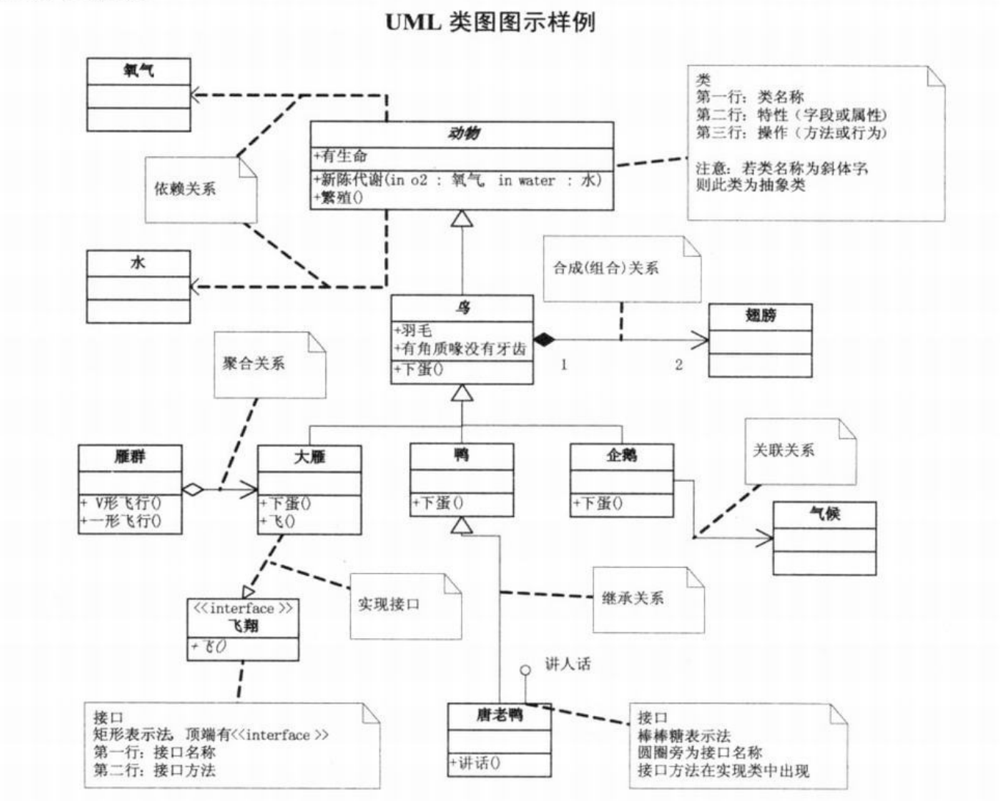
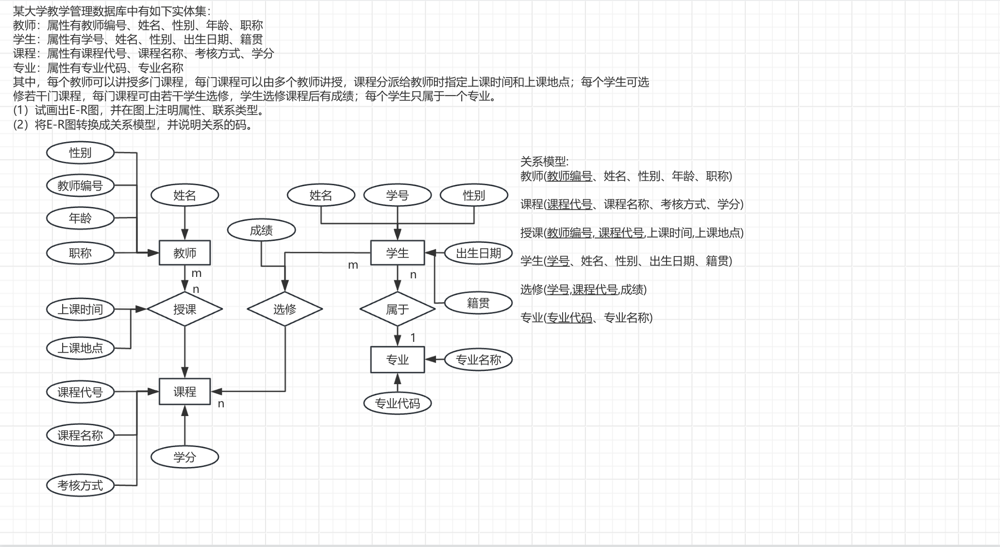

# Software Examination Part

> 本笔记所有内容只针对软件设计师资格考试
> [[toc]]

## UML 常见的 9 种图? <Badge type="tip" text="primary" />

::: details 展开查看

1. 静态结构图

- 类图:(类名位置只有类名)类图是描述系统中的类，以及各个类之间的关系的静态视图。能够让开发人员在正确编写代码以前对系统有一个全面的认识。类图是一种模型类型，确切地说，是一种静态模型类型。类图表示类、接口和它们之间的协作关系。
  
- 对象图:(类名后面接“:”)与类图极为相似，它是类图的实例，对象图显示类的多个对象实例，而不是实际的类。它描述的不是类之间的关系，而是对象之间的关系。
- 部署图:用于建模系统的物理部署。例如，计算机和设备，以及它们之间是如何连接的。部署图的使用者是开发人员、系统集成人员和测试人员。部署图用于表示一组物理结点的集合及结点间的相互关系，从而建立了系统物理层面的模型。

- 构件图(组件图):描述代码构件的物理结构以及各种构建之间的依赖关系。用来建模软件的组件及其相互之间的关系，这些图由构件标记符和构件之间的关系构成。在组件图，构件时软件单个组成部分，它可以是一个文件，产品、可执行文件和脚本等。

1. 动态行为图

- 用例图:描述角色以及角色与用例之间的连接关系。说明是谁要使用系统，以及他们使用该系统可以做些什么。一个用例图包含了多个模型元素，如系统、参与者和用例，并且显示了这些元素之间的各种关系，如泛化、关联和依赖(包含-include、扩展-extend(满足条件时执行)、泛化-父子)。
- 通信图:又叫协作图，和序列图相似，显示对象间的动态合作关系。可以看成是类图和顺序图的交集，协作图建模对象或者角色，以及它们彼此之间是如何通信的。如果强调时间和顺序，则使用序列图;如果强调上下级关系(组织关系)，则选择协作图；这两种图合称为交互图。
- 活动图:描述用例要求所要进行的活动，以及活动间的约束关系，有利于识别并行活动。能够演示出系统中哪些地方存在功能，以及这些功能和系统中其他组件的功能如何共同满足前面使用用例图建模的商务需求(业务逻辑,不涉及代码)。

- 状态图:描述类的对象所有可能的状态，以及事件发生时状态的转移条件，可以捕获对象、子系统和系统的生命周期。它可以告知一个对象可以拥有的状态，并且事件(如消息的接收、时间的流逝、错误、条件变为真等)会怎么随着时间的推移来影响这些状态。一个状态图应该连接到所有具有清晰的可标识状态和复杂行为的类；该图可以确定类的行为，以及该行为如何根据当前的状态变化，也可以展示哪些事件将会改变类的对象的状态。状态图是对类图的补充。
- 顺序图:序列图是用来显示参与者如何以一系列顺序的步骤与系统的对象交互的模型。顺序图可以用来展示对象之间是如何进行交互的。顺序图将显示的重点放在消息序列上，即强调消息是如何在对象之间被发送和接收的。(实线箭头-调用消息,虚线箭头-返回消息,()-返回值看括号里的内容)
  :::

  ## 信息安全的 5 大基本要素? <Badge type="tip" text="primary" />

  ::: details 展开查看

- 机密性: 确保信息不暴露给未授权的实体或过程。
- 完整性: 只有得到允许的人才能修改数据,并且能够判断出数据是否已被篡改。
- 可用性: 得到授权的实体在需要时可访问数据,即攻击者不能占用所有的资源而阻碍授权者的工作。
- 可控性: 可以控制授权范围内的信息流向及行为方式
- 可审查性: 对出现的信息安全问题提供调查的依据和手段

:::

## 常见的加密技术分为哪几大类? <Badge type="tip" text="primary" />

::: details 展开查看
| 加密技术 | 特点 | 常用密钥算法 |
| --- | --- | --- |
| 对称加密(非公开加密) | 使用相同的密钥进行加密和解密, 加密强度不高,但效率高,密钥分发困难 | (DES, AES, 3DES,分组加密)(RC-5,流密码)IDEA, :3ES+51 |
| 非对称加密(公开密钥加密) | 使用不同的密钥进行加密和解密,加密强度高,但效率低,密钥分发容易 | RSA,DSA, ECC :AA+CC |
:::

## 数字签名和信息摘要的作用,常用的算法<Badge type="tip" text="primary" />

::: details 展开查看

- 数字签名:确保数据的完整性和来源的可靠性,常用算法有 RSA,DSA,ECC(A 与 B 通信,数据签名使用 A 的私钥,验证签名使用 A 的公钥)
- 信息摘要:生成数据的固定长度的字符串(由单向散列函数加密成固定长度的散列值),用于数据的校验和比对,常用算法有 MD5(128 位),SHA-1(160 位),SHA-256(256 位)
- 数字证书:用于确认实体的身份,合法性认证相当于派出所出具的证明
  :::

## 网络安全协议有哪些?<Badge type="tip" text="primary" />

::: details 展开查看

- PGP(Pretty Good Privacy):优良保密协议,针对邮件和文件的混合加密系统
- SSL(Secure Sockets Layer):安全套接字协议,工作在传输层至应用层, http 默认端口 80, https 默认端口 443
- TLS(Transport Layer Security):传输层安全协议
- SET(Secure Electronic Transaction):安全电子交易协议,用于电子商务和身份认证,归于应用层
- IPSEC(Internet Protocol Security):互联网协议安全协议,用于保护 IP 数据包的机密性和完整性
- POP3(Post Office Protocol version 3):邮局协议版本 3,用于从邮件服务器下载邮件,默认端口 110
- SMTP(Simple Mail Transfer Protocol):简单邮件传输协议,用于发送邮件,默认端口 25
- FTP(File Transfer Protocol):文件传输协议,用于在客户端和服务器之间传输文件,默认端口 20
  :::

## 网络攻击按形式分有哪几种?<Badge type="tip" text="primary" />

::: details 展开查看

- 被动攻击
  - 监听(保密性):
    - 消息内容获取
    - 业务流分析
    - 非法登录
- 主动攻击
  - 中断(可用性)
  - 篡改(完整性)
  - 伪造(可控性)

:::

## ER(Entity-relationship model)是什么?如何转换成关系模型?<Badge type="tip" text="primary" />

::: details 展开查看

- ER 模型:实体-关系模型,是一种用于表示现实世界对象及其关系的模型,是数据库设计的基础
- 转换成关系模型:将实体转换成表,将关系转换成表之间的关系
  
  :::

## 6 大设计原则和 23 个设计模式(java版本)?<Badge type="tip" text="middle" /> [参考链接](https://blog.csdn.net/a13545564067/article/details/145159021)

::: details 展开查看

- 6 大设计原则:
  | 设计原则 | 描述 | 目标 |
  | --- | --- | --- |
  单一职责原则（SRP, Single Responsibility Principle）| 每个类应该只有一个引起变化的原因，职责应该保持单一。 | 高内聚，低耦合。
  开闭原则（OCP, Open/Closed Principle）| 软件实体（类、模块、函数等）应该对扩展开放，对修改关闭。 | 目标：通过扩展实现变化，而非直接修改代码。| 高内聚，低耦合。
  里氏替换原则（LSP, Liskov Substitution Principle）| 子类必须能够替代其父类而不改变程序的正确性。 | 保证继承的正确性。
  依赖倒置原则（DIP, Dependency Inversion Principle）| 高层模块不依赖于低层模块，二者都应该依赖于抽象（接口/抽象类）。 | 面向接口编程，解耦高层与底层。
  接口隔离原则（ISP, Interface Segregation Principle）| 一个类不应该强制依赖不需要的接口，接口应该小而专一。 | 避免对一个类造成无关的强耦合。
  | 以上 5 种原则常被称为 SOLID 原则 | |
  迪米特法则（LoD, Law of Demeter，又称最少知道原则）| 一个对象应该尽量少地了解其他对象，应通过中介转交信息而非直接依赖。 | 降低对象之间的耦合性。

  | 设计原则 | 相关设计模式 |
  | --- | --- |
  | 单一职责原则 | 建造者模式、代理模式、外观模式 |
  | 开放封闭原则 | 策略模式、装饰器模式、观察者模式、模板方法模式 |
  | 里氏替换原则 | 工厂方法模式、适配器模式、组合模式 |
  | 依赖倒置原则 | 抽象工厂模式、桥接模式、观察者模式、依赖注入 |
  | 接口分离原则 | 适配器模式、外观模式、代理模式、桥接模式 |
  | 迪米特法则 | 中介者模式、外观模式、命令模式 |
- 23 个设计模式:

  #### 创建型模式（Creational Patterns）
  创建型模式的关注点是对象的创建。它们通过对对象创建过程的抽象，减少代码中的耦合性，使创建对象的过程更灵活和可控。它们解决的问题通常是：如何以更优雅、灵活的方式创建对象，同时避免直接使用 new 关键字的硬编码 
    1. 单例模式（Singleton Pattern）: 单例模式确保一个类只有一个实例，并提供全局访问点。
    - 示例代码:
    ```java
      public class Singleton {
        private static Singleton instance;
        private Singleton() {}
        public static Singleton getInstance() {
          if (instance == null) {
                instance = new Singleton();
          }
          return instance;
        }
      }
      System.out.println(Singleton.getInstance() == Singleton.getInstance()); // true
    ```
    2. 工厂方法模式（Factory Method Pattern）
    - 定义一个创建对象的接口，但由子类决定实例化的具体类。
    - 示例代码
    ```java
      // 抽象产品
      abstract class Animal {
        public abstract String makeSound();
      }

      // 具体产品
      class Dog extends Animal {
        @Override
        public String makeSound() {
          return "Woof!";
        }
      }

     class Cat extends Animal {
        @Override
        public String makeSound() {
          return "Meow!";
        }
      }

      // 工厂类
      public class AnimalFactory {
        public static Animal getAnimal(String animalType) {
        switch (animalType.toLowerCase()) {
            case "dog":
                return new Dog();
            case "cat":
                return new Cat();
            default:
                throw new IllegalArgumentException("Unknown animal type: " + animalType);
          }
        }
      }

    Animal animal = AnimalFactory.getAnimal("dog");
        System.out.println(animal.makeSound());  // 输出: "Woof!"
    ```
    3. 抽象工厂模式（Abstract Factory Pattern）
    - 提供一个接口，用于创建相关或依赖对象的集合，而不需要指定它们的具体类。
    - 示例代码
    ```java
      // 抽象产品
      abstract class Chair {
          public abstract String sitOn();
      }

      abstract class Sofa {
          public abstract String lieOn();
      }

      // 具体产品
      class ModernChair extends Chair {
          @Override
          public String sitOn() {
              return "Sitting on a modern chair";
          }
      }

      class ModernSofa extends Sofa {
          @Override
          public String lieOn() {
              return "Lying on a modern sofa";
          }
      }

      class VictorianChair extends Chair {
          @Override
          public String sitOn() {
              return "Sitting on a Victorian chair";
          }
      }

      class VictorianSofa extends Sofa {
          @Override
          public String lieOn() {
              return "Lying on a Victorian sofa";
          }
      }

      // 抽象工厂
      abstract class FurnitureFactory {
          public abstract Chair createChair();
          public abstract Sofa createSofa();
      }

      // 具体工厂
      class ModernFurnitureFactory extends FurnitureFactory {
          @Override
          public Chair createChair() {
              return new ModernChair();
          }
          
          @Override
          public Sofa createSofa() {
              return new ModernSofa();
          }
      }

      class VictorianFurnitureFactory extends FurnitureFactory {
          @Override
          public Chair createChair() {
              return new VictorianChair();
          }
          
          @Override
          public Sofa createSofa() {
              return new VictorianSofa();
          }
      }

      // 客户端测试
      public class AbstractFactoryDemo {
          public static void furnitureClient(FurnitureFactory factory) {
              Chair chair = factory.createChair();
              Sofa sofa = factory.createSofa();
              System.out.println(chair.sitOn());
              System.out.println(sofa.lieOn());
          }

          public static void main(String[] args) {
              FurnitureFactory modernFactory = new ModernFurnitureFactory();
              FurnitureFactory victorianFactory = new VictorianFurnitureFactory();

              System.out.println("Modern Furniture:");
              furnitureClient(modernFactory);

              System.out.println("\nVictorian Furniture:");
              furnitureClient(victorianFactory);
          }
      }
    ```
    4. 建造者模式（Builder Pattern）
    - 将一个复杂对象的构建过程与其表示分离，使得同样的构建过程可以创建不同的表示。
    - 示例代码
    ```java
    // 产品类
      class House {
          private String walls;
          private String doors;
          private String windows;

          public void setWalls(String walls) {
              this.walls = walls;
          }

          public void setDoors(String doors) {
              this.doors = doors;
          }

          public void setWindows(String windows) {
              this.windows = windows;
          }

          @Override
          public String toString() {
              return "House with " + walls + ", " + doors + ", and " + windows;
          }
      }

      // 抽象建造者
      abstract class HouseBuilder {
          protected House house = new House();

          abstract void buildWalls();
          abstract void buildDoors();
          abstract void buildWindows();

          public House getResult() {
              return house;
          }
      }

      // 具体建造者
      class SimpleHouseBuilder extends HouseBuilder {
          @Override
          void buildWalls() {
              house.setWalls("basic walls");
          }

          @Override
          void buildDoors() {
              house.setDoors("simple doors");
          }

          @Override
          void buildWindows() {
              house.setWindows("plain windows");
          }
      }

      // 指挥者
      class Director {
          private final HouseBuilder builder;

          public Director(HouseBuilder builder) {
              this.builder = builder;
          }

          public void construct() {
              builder.buildWalls();
              builder.buildDoors();
              builder.buildWindows();
          }

          public House getHouse() {
              return builder.getResult();
          }
      }

      // 测试类
      public class BuilderDemo {
          public static void main(String[] args) {
              HouseBuilder builder = new SimpleHouseBuilder();
              Director director = new Director(builder);
              director.construct();
              
              House house = director.getHouse();
              System.out.println(house);
          }
      }
    ```
    5. 原型模式（Prototype Pattern）
    - 通过复制现有对象来创建新的对象（浅拷贝或深拷贝），而不是通过实例化对象。
    - 示例代码
    ```java
      import java.util.HashMap;
      import java.util.Map;
      import java.util.function.Consumer;

      // 可克隆接口
      interface Cloneable<T> {
          T clone();
      }

      // 产品基类
      class Car implements Cloneable<Car> {
          private String name;
          private String color;

          public Car(String name, String color) {
              this.name = name;
              this.color = color;
          }

          // Getters & Setters
          public String getName() { return name; }
          public void setName(String name) { this.name = name; }
          public String getColor() { return color; }
          public void setColor(String color) { this.color = color; }

          @Override
          public String toString() {
              return name + " (" + color + ")";
          }

          // 实现原型克隆方法
          @Override
          public Car clone() {
              // 浅拷贝已足够（字符串不可变）
              return new Car(this.name, this.color);
          }
      }

      // 原型管理器
      class PrototypeRegistry<T> {
          private final Map<String, T> prototypes = new HashMap<>();

          public void register(String key, T prototype) {
              prototypes.put(key, prototype);
          }

          public T clone(String key, Consumer<T> customizer) {
              T prototype = prototypes.get(key);
              if (prototype == null) {
                  throw new IllegalArgumentException("Prototype not found: " + key);
              }
              
              T clone = ((Cloneable<T>) prototype).clone();
              customizer.accept(clone);
              return clone;
          }
      }

      // 测试类
      public class PrototypeDemo {
          public static void main(String[] args) {
              // 创建原型注册表
              PrototypeRegistry<Car> registry = new PrototypeRegistry<>();
              
              // 注册基础原型
              registry.register("basic_car", new Car("Generic Car", "white"));
              
              // 克隆并定制第一个对象
              Car car1 = registry.clone("basic_car", car -> {
                  car.setName("Tesla Model S");
                  car.setColor("red");
              });
              
              // 克隆并定制第二个对象
              Car car2 = registry.clone("basic_car", car -> {
                  car.setName("BMW 3 Series");
                  car.setColor("blue");
              });

              // 验证结果
              System.out.println(car1);  // 输出: Tesla Model S (red)
              System.out.println(car2);  // 输出: BMW 3 Series (blue)
              
              // 验证原型未被修改
              System.out.println(registry.clone("basic_car", car -> {}));  // 输出: Generic Car (white)
          }
      }
    ```
    #### 结构型模式（Structural Patterns）
    结构型模式的关注点是程序的对象结构。它们处理的是如何优雅地组织类和对象之间的关系，以形成更大的、灵活的结构。
    它们解决的问题是：如何组合类和对象来构建更复杂的、系统化的结构，同时保持系统的可扩展性和模块化。           
    6. 适配器模式（Adapter Pattern）
    - 将一个类的接口转换为客户端期望的另一种接口，使原本接口不兼容的类可以一起工作。
    - 示例代码
      ```java
        // 旧类（不兼容的类）
        class OldPrinter {
            public String printText() {
                return "This is an old printer.";
            }
        }

        // 新接口（客户端期望的接口）
        interface NewInterface {
            String print();
        }

        // 适配器类（桥接新旧接口）
        class PrinterAdapter implements NewInterface {
            private final OldPrinter oldPrinter;
            
            public PrinterAdapter(OldPrinter oldPrinter) {
                this.oldPrinter = oldPrinter;
            }
            
            @Override
            public String print() {
                return oldPrinter.printText();
            }
        }

        // 测试类
        public class AdapterDemo {
            public static void main(String[] args) {
                OldPrinter oldPrinter = new OldPrinter();
                NewInterface adapter = new PrinterAdapter(oldPrinter);
                
                System.out.println(adapter.print());  // 输出: This is an old printer.
            }
        }
      ```

      7. 桥接模式（Bridge Pattern）
      - 将抽象部分与它的实现部分分离，使它们都可以独立变化。
      - 示例代码
      ```java
      // 实现部分接口
        interface DrawingAPI {
            void drawCircle(double x, double y, double radius);
        }

        // 具体实现类
        class DrawingAPI1 implements DrawingAPI {
            @Override
            public void drawCircle(double x, double y, double radius) {
                System.out.printf("API1.circle at (%.1f, %.1f) with radius %.1f%n", x, y, radius);
            }
        }

        class DrawingAPI2 implements DrawingAPI {
            @Override
            public void drawCircle(double x, double y, double radius) {
                System.out.printf("API2.circle at (%.1f, %.1f) with radius %.1f%n", x, y, radius);
            }
        }

        // 抽象部分
        abstract class Shape {
            protected final DrawingAPI drawingAPI;

            public Shape(DrawingAPI drawingAPI) {
                this.drawingAPI = drawingAPI;
            }

            public abstract void draw();
        }

        // 具体形状类
        class Circle extends Shape {
            private final double x;
            private final double y;
            private final double radius;

            public Circle(double x, double y, double radius, DrawingAPI drawingAPI) {
                super(drawingAPI);
                this.x = x;
                this.y = y;
                this.radius = radius;
            }

            @Override
            public void draw() {
                drawingAPI.drawCircle(x, y, radius);
            }
        }

        // 测试类
        public class BridgeDemo {
            public static void main(String[] args) {
                // 创建不同API实现的圆
                Shape circle1 = new Circle(1, 2, 3, new DrawingAPI1());
                circle1.draw();  // 输出: API1.circle at (1.0, 2.0) with radius 3.0

                Shape circle2 = new Circle(5, 7, 9, new DrawingAPI2());
                circle2.draw();  // 输出: API2.circle at (5.0, 7.0) with radius 9.0
            }
        }
      ```

      8. 组合模式（Composite Pattern）
      - 将对象组合成树形结构，以表示 “整体 - 部分” 的层次结构，并使客户端对单个对象和组合对象的使用具有一致性。
      - 示例代码
      ```java
        import java.util.ArrayList;
        import java.util.List;

        // 组件接口
        interface Component {
            void show();
        }

        // 叶子节点
        class Leaf implements Component {
            private final String name;

            public Leaf(String name) {
                this.name = name;
            }

            @Override
            public void show() {
                System.out.println("Leaf: " + name);
            }
        }

        // 复合节点
        class Composite implements Component {
            private final String name;
            private final List<Component> children = new ArrayList<>();

            public Composite(String name) {
                this.name = name;
            }

            public void add(Component component) {
                children.add(component);
            }

            @Override
            public void show() {
                System.out.println("Composite: " + name);
                for (Component child : children) {
                    child.show();
                }
            }
        }

        // 测试类
        public class CompositeDemo {
            public static void main(String[] args) {
                // 创建根节点
                Composite root = new Composite("Root");
                
                // 添加叶子节点
                root.add(new Leaf("Leaf A"));
                root.add(new Leaf("Leaf B"));
                
                // 创建分支节点
                Composite branch = new Composite("Branch X");
                branch.add(new Leaf("Leaf XA"));
                branch.add(new Leaf("Leaf XB"));
                
                // 将分支添加到根节点
                root.add(branch);
                
                // 显示整个结构
                root.show();
            }
        }
      ```

      9. 装饰器模式（Decorator Pattern）
      - 动态地给一个对象添加一些额外的职责，而不会影响其他对象的功能。
      - 示例代码
      ```java
      // 组件接口
      interface Coffee {
          int cost();
          String description();
      }

      // 基础组件
      class BasicCoffee implements Coffee {
          @Override
          public int cost() {
              return 5;
          }

          @Override
          public String description() {
              return "Coffee";
          }
      }

      // 装饰器抽象类
      abstract class CoffeeDecorator implements Coffee {
          protected final Coffee coffee;

          public CoffeeDecorator(Coffee coffee) {
              this.coffee = coffee;
          }

          @Override
          public int cost() {
              return coffee.cost();
          }

          @Override
          public String description() {
              return coffee.description();
          }
      }

      // 具体装饰器：牛奶
      class Milk extends CoffeeDecorator {
          public Milk(Coffee coffee) {
              super(coffee);
          }

          @Override
          public int cost() {
              return super.cost() + 2;
          }

          @Override
          public String description() {
              return super.description() + " + Milk";
          }
      }

      // 具体装饰器：糖
      class Sugar extends CoffeeDecorator {
          public Sugar(Coffee coffee) {
              super(coffee);
          }

          @Override
          public int cost() {
              return super.cost() + 1;
          }

          @Override
          public String description() {
              return super.description() + " + Sugar";
          }
      }

      // 测试类
      public class DecoratorDemo {
          public static void main(String[] args) {
              // 基础咖啡
              Coffee coffee = new BasicCoffee();
              System.out.println(coffee.description() + " costs: " + coffee.cost());
              
              // 添加牛奶
              coffee = new Milk(coffee);
              System.out.println(coffee.description() + " costs: " + coffee.cost());
              
              // 添加糖
              coffee = new Sugar(coffee);
              System.out.println(coffee.description() + " costs: " + coffee.cost());
          }
      }
      ```

      10. 外观模式（Facade Pattern）
      - 为子系统中的一组接口提供一个统一的高层接口，使得子系统更易于使用。
      - 示例代码
      ```java
      // CPU类
      class CPU {
          public void start() {
              System.out.println("CPU started.");
          }

          public void stop() {
              System.out.println("CPU stopped.");
          }
      }

      // 内存类
      class Memory {
          public void load() {
              System.out.println("Memory loaded.");
          }

          public void clear() {
              System.out.println("Memory cleared.");
          }
      }

      // 硬盘类
      class HardDrive {
          public void read() {
              System.out.println("HardDrive reading data.");
          }

          public void write() {
              System.out.println("HardDrive writing data.");
          }
      }

      // 外观类 - 计算机门面
      class ComputerFacade {
          private CPU cpu;
          private Memory memory;
          private HardDrive hardDrive;

          // 构造方法初始化组件
          public ComputerFacade() {
              this.cpu = new CPU();
              this.memory = new Memory();
              this.hardDrive = new HardDrive();
          }

          // 启动计算机
          public void startComputer() {
              cpu.start();
              memory.load();
              hardDrive.read();
          }

          // 关闭计算机
          public void shutdownComputer() {
              hardDrive.write();
              memory.clear();
              cpu.stop();
          }
      }

      // 测试类
      public class ComputerTest {
          public static void main(String[] args) {
              ComputerFacade computer = new ComputerFacade();
              computer.startComputer();
              computer.shutdownComputer();
          }
      }
      ```

      11. 享元模式（Flyweight Pattern）
      - 通过共享技术实现大量细粒度对象的高效利用，减少内存占用。
      - 示例代码
      ```java
      import java.util.HashMap;
      import java.util.Map;

      // 享元类
      class Flyweight {
          private final String sharedState;

          public Flyweight(String sharedState) {
              this.sharedState = sharedState;
          }

          public void operation(String uniqueState) {
              System.out.println("Shared: " + sharedState + ", Unique: " + uniqueState);
          }
      }

      // 享元工厂
      class FlyweightFactory {
          private final Map<String, Flyweight> flyweights = new HashMap<>();

          public Flyweight getFlyweight(String key) {
              // 如果不存在则创建新的享元实例
              flyweights.putIfAbsent(key, new Flyweight(key));
              return flyweights.get(key);
          }
      }

      // 测试类
      public class FlyweightDemo {
          public static void main(String[] args) {
              FlyweightFactory factory = new FlyweightFactory();
              
              // 获取共享享元对象
              Flyweight flyweight1 = factory.getFlyweight("State A");
              Flyweight flyweight2 = factory.getFlyweight("State A");
              
              // 验证是否是同一个对象
              System.out.println("flyweight1 == flyweight2: " + (flyweight1 == flyweight2));
              
              // 使用共享对象
              flyweight1.operation("Unique 1");
              flyweight2.operation("Unique 2");
          }
      }
      ```

      12. 代理模式（Proxy Pattern）
      - 为其他对象提供一个代理，以控制对该对象的访问。
      - 示例代码
      ```java
      // 主题接口
      interface Subject {
          void request();
      }

      // 真实主题实现接口
      class RealSubject implements Subject {
          @Override
          public void request() {
              System.out.println("RealSubject handling the request.");
          }
      }

      // 代理类实现接口
      class Proxy implements Subject {
          private Subject realSubject;

          public Proxy(Subject realSubject) {
              this.realSubject = realSubject;
          }

          @Override
          public void request() {
              System.out.println("Proxy delegating request to RealSubject.");
              realSubject.request();
          }
      }

      // 测试类
      public class ProxyPatternTest {
          public static void main(String[] args) {
              Subject realSubject = new RealSubject();
              Subject proxy = new Proxy(realSubject);
              proxy.request();
          }
      }
      ```
   #### 行为型模式（Behavioral Patterns）
   行为型模式的关注点是对象之间的交互和职责分配。它们描述的是对象如何协作以完成任务，以及职责如何分配到不同的类之中。它们解决的问题是：在运行时，让对象之间的通信变得灵活、解耦，并使代码具有更清晰的逻辑。

    13. 责任链模式（Chain of Responsibility Pattern）
    - 将多个对象以链式结构组织起来，使得这些对象依次处理一个请求，直到有对象处理成功为止。
    - 示例代码
      ```java
      // 抽象处理者
      abstract class Handler {
          protected Handler successor;

          public Handler(Handler successor) {
              this.successor = successor;
          }

          public abstract void handle(String request);
      }

      // 具体处理者A
      class ConcreteHandlerA extends Handler {
          public ConcreteHandlerA(Handler successor) {
              super(successor);
          }

          @Override
          public void handle(String request) {
              if ("A".equals(request)) {
                  System.out.println("Handler A handled the request");
              } else if (successor != null) {
                  successor.handle(request);
              }
          }
      }

      // 具体处理者B
      class ConcreteHandlerB extends Handler {
          public ConcreteHandlerB(Handler successor) {
              super(successor);
          }

          @Override
          public void handle(String request) {
              if ("B".equals(request)) {
                  System.out.println("Handler B handled the request");
              } else if (successor != null) {
                  successor.handle(request);
              }
          }
      }

      // 测试类
      public class ChainOfResponsibilityDemo {
          public static void main(String[] args) {
              // 创建处理链：A -> B
              Handler handlerChain = new ConcreteHandlerA(new ConcreteHandlerB(null));
              
              // 测试不同请求
              System.out.println("Test request 'A':");
              handlerChain.handle("A");  // Handler A handled
              
              System.out.println("\nTest request 'B':");
              handlerChain.handle("B");  // Handler B handled
              
              System.out.println("\nTest request 'C':");
              handlerChain.handle("C");  // 未处理
          }
      }
      ```

      14. 命令模式（Command Pattern）
      - 将请求封装为一个对象，从而使用户可以用不同的请求对客户端进行参数化，以及对请求排队或记录请求日志。
      - 示例代码
      ```java
      // 命令接口（对应 Python 的 ABC 抽象类）
      interface Command {
          void execute();
      }

      // 具体命令类（PrintCommand）
      class PrintCommand implements Command {
          // 持有接收者引用和消息参数
          private Receiver receiver;
          private String message;

          // 构造方法注入依赖
          public PrintCommand(Receiver receiver, String message) {
              this.receiver = receiver;
              this.message = message;
          }

          // 实现命令执行逻辑
          @Override
          public void execute() {
              receiver.action(message);
          }
      }

      // 接收者类（Receiver）
      class Receiver {
          // 核心业务逻辑
          public void action(String message) {
              System.out.println("Executing action: " + message);
          }
      }

      // 调用者类（Invoker）
      class Invoker {
          // 存储命令的集合（替代 Python 的列表）
          private java.util.List<Command> commands = new java.util.ArrayList<>();

          // 添加命令到队列
          public void addCommand(Command command) {
              commands.add(command);
          }

          // 批量执行所有命令
          public void executeCommands() {
              for (Command command : commands) {
                  command.execute();
              }
          }
      }

      // 测试类（程序入口）
      public class CommandPatternTest {
          public static void main(String[] args) {
              // 1. 创建接收者
              Receiver receiver = new Receiver();
              
              // 2. 创建具体命令并关联接收者
              Command command1 = new PrintCommand(receiver, "Command 1");
              Command command2 = new PrintCommand(receiver, "Command 2");
              
              // 3. 创建调用者并添加命令
              Invoker invoker = new Invoker();
              invoker.addCommand(command1);
              invoker.addCommand(command2);
              
              // 4. 执行所有命令
              invoker.executeCommands();
          }
      }
      ```

      15. 解释器模式（Interpreter Pattern）
      - 提供一种解释语言的语法或表达式的方式，并实现解释器来处理这些语言规则。
      - 示例代码
      ```java
      import java.util.Arrays;

      // 抽象表达式
      abstract class Expression {
          public abstract int interpret();
      }

      // 数字表达式（终结符）
      class Number extends Expression {
          private final int value;

          public Number(int value) {
              this.value = value;
          }

          @Override
          public int interpret() {
              return value;
          }
      }

      // 加法表达式（非终结符）
      class Add extends Expression {
          private final Expression left;
          private final Expression right;

          public Add(Expression left, Expression right) {
              this.left = left;
              this.right = right;
          }

          @Override
          public int interpret() {
              return left.interpret() + right.interpret();
          }
      }

      // 减法表达式（非终结符）
      class Subtract extends Expression {
          private final Expression left;
          private final Expression right;

          public Subtract(Expression left, Expression right) {
              this.left = left;
              this.right = right;
          }

          @Override
          public int interpret() {
              return left.interpret() - right.interpret();
          }
      }

      // 解析器
      class Parser {
          public static Expression parse(String expression) {
              String[] tokens = expression.split("\\s+");
              Expression result = new Number(Integer.parseInt(tokens[0]));
              
              int i = 1;
              while (i < tokens.length) {
                  String operator = tokens[i];
                  Expression nextNumber = new Number(Integer.parseInt(tokens[i + 1]));
                  
                  switch (operator) {
                      case "+":
                          result = new Add(result, nextNumber);
                          break;
                      case "-":
                          result = new Subtract(result, nextNumber);
                          break;
                      default:
                          throw new IllegalArgumentException("Unsupported operator: " + operator);
                  }
                  
                  i += 2;
              }
              
              return result;
          }
      }

      // 测试类
      public class InterpreterDemo {
          public static void main(String[] args) {
              String expression = "3 + 5 - 2";
              Expression parsedExpression = Parser.parse(expression);
              int result = parsedExpression.interpret();
              System.out.println("Result of '" + expression + "' is: " + result);
          }
      }
      ```

      16. 迭代器模式（Iterator Pattern）
      - 提供一种方法，使对象集合可以顺序访问其中的元素，而无须暴露集合内部表示方式。
      - 示例代码
      ```java
      import java.util.Iterator;
      import java.util.NoSuchElementException;

      // 实现Java标准Iterator接口的自定义迭代器
      class MyIterator implements Iterator<Integer> {
          private int[] data;
          private int index;

          public MyIterator(int[] data) {
              this.data = data;
              this.index = 0;
          }

          // 实现标准hasNext方法
          @Override
          public boolean hasNext() {
              return index < data.length;
          }

          // 实现标准next方法
          @Override
          public Integer next() {
              if (!hasNext()) {
                  throw new NoSuchElementException("No more elements");
              }
              return data[index++]; // 简化索引自增逻辑
          }

          // 可选：实现remove方法（若无需删除可抛出UnsupportedOperationException）
          @Override
          public void remove() {
              throw new UnsupportedOperationException("Remove operation is not supported");
          }
      }

      // 测试类
      public class IteratorPatternTest {
          public static void main(String[] args) {
              int[] data = {1, 2, 3};
              MyIterator iterator = new MyIterator(data);
              
              // 方式1：while循环（贴合原Python逻辑）
              while (iterator.hasNext()) {
                  System.out.println(iterator.next());
              }

              // 方式2：增强for循环（需封装迭代器到可迭代对象，扩展示例）
              IterableData iterableData = new IterableData(data);
              for (int num : iterableData) {
                  System.out.println(num);
              }
          }
      }

      // 扩展：可迭代对象（支持增强for循环）
      class IterableData implements Iterable<Integer> {
          private int[] data;

          public IterableData(int[] data) {
              this.data = data;
          }

          @Override
          public Iterator<Integer> iterator() {
              return new MyIterator(data);
          }
      }
      ```

      17. 中介者模式（Mediator Pattern）
      - 用一个中介对象来封装一组对象之间的交互，使这些对象之间不需要显式相互引用，从而实现松散耦合。
      - 示例代码
      ```java
      // 中介者抽象类（对应Python的Mediator基类）
      abstract class Mediator {
          // 抽象通知方法
          public abstract void notify(Colleague sender, String event);
      }

      // 具体中介者类（ConcreteMediator）
      class ConcreteMediator extends Mediator {
          // 持有同事对象的引用
          private Colleague1 colleague1;
          private Colleague2 colleague2;

          // 构造方法初始化同事对象，并关联中介者
          public ConcreteMediator() {
              this.colleague1 = new Colleague1(this);
              this.colleague2 = new Colleague2(this);
          }

          // 实现通知逻辑：根据事件触发不同同事的行为
          @Override
          public void notify(Colleague sender, String event) {
              if ("event1".equals(event)) {
                  System.out.println("Mediator reacts to event1 and triggers Colleague2");
                  colleague2.doAction();
              } else if ("event2".equals(event)) {
                  System.out.println("Mediator reacts to event2 and triggers Colleague1");
                  colleague1.doAction();
              }
          }

          // 提供获取同事对象的方法（供测试调用）
          public Colleague1 getColleague1() {
              return colleague1;
          }

          public Colleague2 getColleague2() {
              return colleague2;
          }
      }

      // 同事抽象类（Colleague）
      abstract class Colleague {
          // 持有中介者引用
          protected Mediator mediator;

          // 构造方法注入中介者
          public Colleague(Mediator mediator) {
              this.mediator = mediator;
          }
      }

      // 具体同事类1（Colleague1）
      class Colleague1 extends Colleague {
          public Colleague1(Mediator mediator) {
              super(mediator);
          }

          // 同事1的具体行为
          public void doAction() {
              System.out.println("Colleague1 does action");
          }
      }

      // 具体同事类2（Colleague2）
      class Colleague2 extends Colleague {
          public Colleague2(Mediator mediator) {
              super(mediator);
          }

          // 同事2的具体行为
          public void doAction() {
              System.out.println("Colleague2 does action");
          }
      }

      // 测试类（程序入口）
      public class MediatorPatternTest {
          public static void main(String[] args) {
              // 创建具体中介者对象（自动初始化同事对象）
              ConcreteMediator mediator = new ConcreteMediator();
              
              // 模拟同事1触发event1，通过中介者通知并触发同事2的行为
              mediator.notify(mediator.getColleague1(), "event1");
              
              // 可选测试：模拟同事2触发event2
              // mediator.notify(mediator.getColleague2(), "event2");
          }
      }
      ```

      18. 备忘录模式（Memento Pattern）
      - 保存对象的某个状态，以便在适当的时候恢复。
      - 示例代码
      ```java
      // 备忘录类（Memento）：存储原始对象的状态，封装状态的读写
      class Memento {
          // 私有状态，仅通过 getter 暴露
          private String state;

          // 构造方法初始化状态
          public Memento(String state) {
              this.state = state;
          }

          // 获取状态（仅允许原始类访问，此处简化为 public，可通过包访问控制优化）
          public String getState() {
              return state;
          }
      }

      // 原始类（Originator）：文本编辑器，负责创建/恢复备忘录
      class TextEditor {
          // 核心状态：编辑的文本
          private String text = "";

          // 输入文字（修改状态）
          public void type(String words) {
              text += words;
          }

          // 获取当前文本
          public String getText() {
              return text;
          }

          // 创建备忘录：保存当前状态
          public Memento save() {
              return new Memento(this.text);
          }

          // 恢复状态：从备忘录中还原
          public void restore(Memento memento) {
              if (memento != null) { // 防止空备忘录导致异常
                  this.text = memento.getState();
              }
          }
      }

      // 管理者类（Caretaker）：管理备忘录历史，不修改/访问备忘录内容
      class Caretaker {
          // 存储备忘录的历史记录（栈结构，适配 undo 逻辑）
          private java.util.Stack<Memento> history = new java.util.Stack<>();

          // 添加备忘录到历史
          public void save(Memento memento) {
              history.push(memento);
          }

          // 撤销：弹出最后保存的备忘录（栈顶）
          public Memento undo() {
              if (history.isEmpty()) {
                  return null;
              }
              return history.pop();
          }
      }

      // 测试类（客户端代码）
      public class MementoPatternTest {
          public static void main(String[] args) {
              // 初始化编辑器和管理者
              TextEditor editor = new TextEditor();
              Caretaker caretaker = new Caretaker();

              // 输入第一段文字并保存状态
              editor.type("Hello, ");
              caretaker.save(editor.save());

              // 输入第二段文字并保存状态
              editor.type("world!");
              caretaker.save(editor.save());

              // 输入第三段文字
              editor.type(" This is a demo of Memento Pattern.");
              System.out.println("当前文本: " + editor.getText());

              // 第一次撤销
              editor.restore(caretaker.undo());
              System.out.println("撤销后: " + editor.getText());

              // 第二次撤销
              editor.restore(caretaker.undo());
              System.out.println("再次撤销后: " + editor.getText());
          }
      }
      ```

      19. 观察者模式（Observer Pattern）
      - 定义对象间的一对多依赖，当被观察的对象状态改变时，所有观察者对象都会收到通知。
      - 示例代码
      ```java
      import java.util.Observable;
      import java.util.Observer;

      // 主题类：继承Java标准Observable
      class ConcreteSubject extends Observable {
          // 触发通知的方法（自定义业务逻辑）
          public void doNotify() {
              setChanged(); // 标记状态已变更（Observable要求）
              notifyObservers(); // 通知所有观察者
          }
      }

      // 具体观察者A：实现Java标准Observer
      class ConcreteObserverA implements Observer {
          @Override
          public void update(Observable o, Object arg) {
              System.out.println("Observer A: Received update!");
          }
      }

      // 具体观察者B：实现Java标准Observer
      class ConcreteObserverB implements Observer {
          @Override
          public void update(Observable o, Object arg) {
              System.out.println("Observer B: Received update!");
          }
      }

      // 测试类
      public class StandardObserverTest {
          public static void main(String[] args) {
              ConcreteSubject subject = new ConcreteSubject();
              subject.addObserver(new ConcreteObserverA());
              subject.addObserver(new ConcreteObserverB());
              
              subject.doNotify(); // 触发通知
          }
      }
      ```

      20. 状态模式（State Pattern）
      - 允许对象在其内部状态改变时改变其行为。
      - 示例代码
      ```java
      // 文件名：StatePatternWithManager.java
      interface State {
          void handle(Context context);
      }

      // 状态管理器：统一维护状态切换关系
      class StateManager {
          public static State getNextState(State currentState) {
              if (currentState instanceof StateA) {
                  return new StateB();
              } else if (currentState instanceof StateB) {
                  return new StateA();
              }
              throw new IllegalArgumentException("无效的状态类型");
          }
      }

      class StateA implements State {
          @Override
          public void handle(Context context) {
              System.out.println("State A handling. Moving to State B.");
              context.setState(StateManager.getNextState(this));
          }
      }

      class StateB implements State {
          @Override
          public void handle(Context context) {
              System.out.println("State B handling. Moving to State A.");
              context.setState(StateManager.getNextState(this));
          }
      }

      class Context {
          private State state;

          public Context(State state) {
              this.state = state;
          }

          public State getState() {
              return state;
          }

          public void setState(State state) {
              this.state = state;
          }

          public void request() {
              this.state.handle(this);
          }
      }

      public class StatePatternWithManager {
          public static void main(String[] args) {
              Context context = new Context(new StateA());
              context.request();
              context.request();
          }
      }
      ```

      21. 策略模式（Strategy Pattern）
      - 定义一组算法，将每个算法封装到独立的类中，使它们可以互相替换，且算法的变化不会影响客户端。
      - 示例代码
      ```java
      // 单个Java文件实现策略模式（文件名请保存为：StrategyPattern.java）
      // 1. 抽象策略接口
      interface Strategy {
          String execute(String data);
      }

      // 2. 具体策略A
      class StrategyA implements Strategy {
          @Override
          public String execute(String data) {
              return "Executing Strategy A with data " + data;
          }
      }

      // 3. 具体策略B
      class StrategyB implements Strategy {
          @Override
          public String execute(String data) {
              return "Executing Strategy B with data " + data;
          }
      }

      // 4. 环境类
      class Context {
          // 持有当前策略
          private Strategy strategy;

          // 构造方法初始化策略
          public Context(Strategy strategy) {
              this.strategy = strategy;
          }

          // 动态切换策略
          public void setStrategy(Strategy strategy) {
              this.strategy = strategy;
          }

          // 委托策略执行业务逻辑
          public String doWork(String data) {
              return this.strategy.execute(data);
          }
      }

      // 5. 测试类（公共类，文件名需与此类名一致）
      public class StrategyPattern {
          public static void main(String[] args) {
              // 初始化环境，使用策略A
              Context context = new Context(new StrategyA());
              // 执行并打印结果
              System.out.println(context.doWork("test"));

              // 动态切换为策略B
              context.setStrategy(new StrategyB());
              // 执行并打印结果
              System.out.println(context.doWork("test"));
          }
      }
      ```

      22. 模板方法模式（Template Method Pattern）
      - 定义一个操作中的算法骨架，将某些步骤的实现延迟到子类中，使得子类可以在不改变算法结构的情况下重新定义特定步骤的实现。
      - 示例代码
      ```java
      // 单个Java文件实现模板方法模式（文件名请保存为：TemplateMethodPattern.java）
      // 1. 抽象模板类（对应Python的AbstractClass）
      abstract class AbstractClass {
          // 模板方法：定义算法固定流程，用final修饰防止子类重写
          public final void templateMethod() {
              step1();
              step2();
              step3();
          }

          // 抽象方法：可变步骤1，由子类实现
          protected abstract void step1();

          // 具体方法：公共固定步骤2，所有子类共享
          protected void step2() {
              System.out.println("Common step 2");
          }

          // 抽象方法：可变步骤3，由子类实现
          protected abstract void step3();
      }

      // 2. 具体实现类（对应Python的ConcreteClass）
      class ConcreteClass extends AbstractClass {
          @Override
          protected void step1() {
              System.out.println("ConcreteClass: step 1");
          }

          @Override
          protected void step3() {
              System.out.println("ConcreteClass: step 3");
          }
      }

      // 3. 测试类（公共类，文件名需与此类名一致）
      public class TemplateMethodPattern {
          public static void main(String[] args) {
              // 实例化具体实现类
              AbstractClass obj = new ConcreteClass();
              // 调用模板方法执行算法流程
              obj.templateMethod();
          }
      }
      ```

      23. 访问者模式（Visitor Pattern）
      - 将操作分离到访问者类中，使新的操作可以灵活地添加到已存在的对象结构中，而不改变对象结构。
      - 示例代码
      ```java
      // 单个Java文件实现访问者模式（文件名请保存为：VisitorPattern.java）
      import java.lang.Math;

      // 1. 抽象访问者（对应Python的Visitor）
      interface Visitor {
          double visitCircle(Circle circle);
          double visitRectangle(Rectangle rectangle);
          String drawCircle(Circle circle);
          String drawRectangle(Rectangle rectangle);
      }

      // 2. 具体访问者1：计算面积（对应Python的AreaVisitor）
      class AreaVisitor implements Visitor {
          @Override
          public double visitCircle(Circle circle) {
              return Math.PI * circle.getRadius() * circle.getRadius();
          }

          @Override
          public double visitRectangle(Rectangle rectangle) {
              return rectangle.getWidth() * rectangle.getHeight();
          }

          // 绘制操作无需实现（此处为了满足接口，实际不使用，也可拆分接口，见优化说明）
          @Override
          public String drawCircle(Circle circle) {
              return null;
          }

          @Override
          public String drawRectangle(Rectangle rectangle) {
              return null;
          }
      }

      // 3. 具体访问者2：绘制形状（对应Python的DrawVisitor）
      class DrawVisitor implements Visitor {
          // 面积操作无需实现（此处为了满足接口，实际不使用）
          @Override
          public double visitCircle(Circle circle) {
              return 0;
          }

          @Override
          public double visitRectangle(Rectangle rectangle) {
              return 0;
          }

          @Override
          public String drawCircle(Circle circle) {
              return "Drawing a circle with radius " + circle.getRadius();
          }

          @Override
          public String drawRectangle(Rectangle rectangle) {
              return "Drawing a rectangle with width " + rectangle.getWidth() + " and height " + rectangle.getHeight();
          }
      }

      // 4. 抽象元素（对应Python的Shape）
      interface Shape {
          double acceptArea(Visitor visitor);
          String acceptDraw(Visitor visitor);
      }

      // 5. 具体元素1：圆形（对应Python的Circle）
      class Circle implements Shape {
          private double radius;

          public Circle(double radius) {
              this.radius = radius;
          }

          public double getRadius() {
              return radius;
          }

          @Override
          public double acceptArea(Visitor visitor) {
              return visitor.visitCircle(this);
          }

          @Override
          public String acceptDraw(Visitor visitor) {
              return visitor.drawCircle(this);
          }
      }

      // 6. 具体元素2：矩形（对应Python的Rectangle）
      class Rectangle implements Shape {
          private double width;
          private double height;

          public Rectangle(double width, double height) {
              this.width = width;
              this.height = height;
          }

          public double getWidth() {
              return width;
          }

          public double getHeight() {
              return height;
          }

          @Override
          public double acceptArea(Visitor visitor) {
              return visitor.visitCircle(this); // 此处笔误，应为 visitRectangle
          }

          @Override
          public String acceptDraw(Visitor visitor) {
              return visitor.drawRectangle(this);
          }
      }

      // 7. 测试类（公共类，文件名需与此类名一致）
      public class VisitorPattern {
          public static void main(String[] args) {
              // 创建访问者
              Visitor areaVisitor = new AreaVisitor();
              Visitor drawVisitor = new DrawVisitor();

              // 创建形状
              Shape circle = new Circle(5);
              Shape rectangle = new Rectangle(4, 6);

              // 使用访问者计算面积
              System.out.println("Area of Circle: " + circle.acceptArea(areaVisitor));
              System.out.println("Area of Rectangle: " + rectangle.acceptArea(areaVisitor));

              // 使用访问者绘制形状
              System.out.println(circle.acceptDraw(drawVisitor));
              System.out.println(rectangle.acceptDraw(drawVisitor));
          }
      }

      ```

:::
